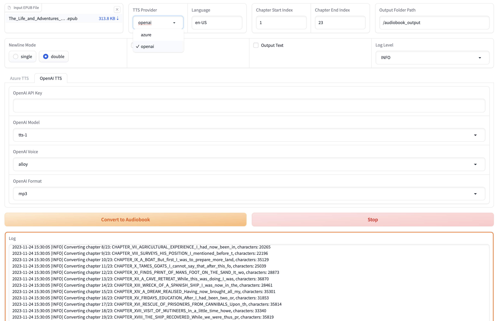

# EPUB to Audiobook Converter [](https://discord.com/invite/pgp2G8zhS7) [](https://deepwiki.com/p0n1/epub_to_audiobook)

*Join our [Discord](https://discord.com/invite/pgp2G8zhS7) server for any questions or discussions. You can also ask questions about this project on [DeepWiki](https://deepwiki.com/p0n1/epub_to_audiobook).*

This project provides a command-line tool to convert EPUB ebooks into audiobooks. It now supports both the [Microsoft Azure Text-to-Speech API](https://learn.microsoft.com/en-us/azure/cognitive-services/speech-service/rest-text-to-speech) (alternativly [EdgeTTS](https://github.com/rany2/edge-tts)) and the [OpenAI Text-to-Speech API](https://platform.openai.com/docs/guides/text-to-speech) to generate the audio for each chapter in the ebook. The output audio files are optimized for use with [Audiobookshelf](https://github.com/advplyr/audiobookshelf).

<!-- *This project was developed with the help of ChatGPT.* -->

## Recent Updates

- 2025-05-23: Added a web interface (WebUI) to the project.

## Audio Sample

If you're interested in hearing a sample of the audiobook generated by this tool, check the links bellow. 

- [Azure TTS Sample](https://audio.com/paudi/audio/0008-chapter-vii-agricultural-experience)
- [OpenAI TTS Sample](https://audio.com/paudi/audio/openai-0008-chapter-vii-agricultural-experience-i-had-now-been-in)
- Edge TTS Sample: the voice is almost the same as Azure TTS
- [Piper TTS](https://rhasspy.github.io/piper-samples/)
- [Kokoro TTS](https://huggingface.co/spaces/hexgrad/Kokoro-TTS) (usage of this is done through a local OpenAI endpoint)

## Requirements

- Python 3.6+ Or ***Docker***
- For using *Azure TTS*, A Microsoft Azure account with access to the [Microsoft Cognitive Services Speech Services](https://portal.azure.com/#create/Microsoft.CognitiveServicesSpeechServices) is required.
- For using *OpenAI TTS*, OpenAI [API Key](https://platform.openai.com/api-keys) is required.
  - If you are using Kokoro TTS, you won't need an official OpenAI key, but you will need to put a dummy value in the env for it. (e.g. `export OPEN_API_KEY='fake'`) unless you are using the docker compose file (see below)
- For using *Edge TTS*, no API Key is required.
- Piper TTS executable and models for *Piper TTS*

## Audiobookshelf Integration

The audiobooks generated by this project are optimized for use with [Audiobookshelf](https://github.com/advplyr/audiobookshelf). Each chapter in the EPUB file is converted into a separate MP3 file, with the chapter title extracted and included as metadata.


### Chapter Titles

Parsing and extracting chapter titles from EPUB files can be challenging, as the format and structure may vary significantly between different ebooks. The script employs a simple but effective method for extracting chapter titles, which works for most EPUB files. The method involves parsing the EPUB file and looking for the `title` tag in the HTML content of each chapter. If the title tag is not present, a fallback title is generated using the first few words of the chapter text.

Please note that this approach may not work perfectly for all EPUB files, especially those with complex or unusual formatting. However, in most cases, it provides a reliable way to extract chapter titles for use in Audiobookshelf.

When you import the generated MP3 files into Audiobookshelf, the chapter titles will be displayed, making it easy to navigate between chapters and enhancing your listening experience.

## Installation

1. Clone this repository:

    ```bash
    git clone https://github.com/p0n1/epub_to_audiobook.git
    cd epub_to_audiobook
    ```

2. Create a virtual environment and activate it:

    ```bash
    python3 -m venv venv
    source venv/bin/activate
    ```

3. Install the required dependencies:

    ```bash
    pip install -r requirements.txt
    ```

4. Set the following environment variables with your Azure Text-to-Speech API credentials, or your OpenAI API key if you're using OpenAI TTS:

    ```bash
    export MS_TTS_KEY=<your_subscription_key> # for Azure
    export MS_TTS_REGION=<your_region> # for Azure
    export OPENAI_API_KEY=<your_openai_api_key> # for OpenAI
    ```

## Web Interface (WebUI)

For users who prefer a graphical interface, this project includes a web-based UI built with Gradio. The WebUI provides an intuitive way to configure all the options and convert your EPUB files without using the command line.



### Environment Variables for WebUI

The WebUI respects the same environment variables as the command-line tool:

```bash
export MS_TTS_KEY=<your_subscription_key>      # For Azure TTS
export MS_TTS_REGION=<your_region>             # For Azure TTS
export OPENAI_API_KEY=<your_openai_api_key>    # For OpenAI TTS
export OPENAI_BASE_URL=<custom_endpoint>       # Optional: For custom OpenAI-compatible endpoints
```

Make sure to set the environment variables for the service you are using before starting the WebUI.

### Starting the WebUI

Make sure you have followed the [Installation](#installation) steps before starting the WebUI.

To launch the web interface, run:

```bash
python3 main_ui.py
```

By default, the WebUI will be available at `http://127.0.0.1:7860`. You can customize the host and port:

```bash
python3 main_ui.py --host 127.0.0.1 --port 8080
```

Remember to press `Ctrl+C` in the terminal to stop the server if you want to stop it after you are done.

### WebUI Features

The web interface provides:

- **File Upload**: Drag and drop your EPUB file directly into the browser
- **TTS Provider Selection**: Easy switching between Azure, OpenAI, Edge, and Piper TTS with provider-specific options
- **Voice Configuration**: Dropdown menus for selecting languages, voices, and output formats
- **Advanced Settings**: All command-line options are available through the web interface
- **Real-time Logs**: View conversion progress and logs directly in the browser
- **Preview Mode**: Test your settings without generating audio
- **Search & Replace**: Upload text replacement files for pronunciation fixes

### Using the WebUI

1. **Upload your EPUB file** using the file selector
2. **Choose your TTS provider** from the tabs (OpenAI, Azure, Edge, or Piper)
3. **Configure provider-specific settings**:
   - **OpenAI**: Select model, voice, speed, and format
   - **Azure**: Choose language, voice, format, and break duration
   - **Edge**: Set language, voice, rate, volume, and pitch
   - **Piper**: Configure local or Docker deployment with voice options
4. **Set output directory** or use the default timestamped folder
5. **Adjust advanced options** if needed (chapter range, text processing, etc.)
6. **Click Start** to begin conversion
7. **Monitor progress** through the integrated log viewer

You can select a few chapters to preview the audio before starting the full conversion.

### Docker with WebUI (The Easiest Way If You Are Familiar With Docker)

You can also run the WebUI using Docker. Use the provided `docker-compose.webui.yml` file. Make sure to edit the file with your API keys for your TTS provider.

```bash
# Edit docker-compose.webui.yml with your API keys
docker compose -f docker-compose.webui.yml up
```

The WebUI will be accessible at `http://localhost:7860` or `http://127.0.0.1:7860`.

### Security Considerations of WebUI

The WebUI is a web application that runs on your local machine. It's currently not designed to be accessible from the open internet. There is no authorization mechanism in place. So you should not expose it to the open internet otherwise it would lead to unauthorized access to your TTS providers.

## Usage

To convert an EPUB ebook to an audiobook, run the following command, specifying the TTS provider of your choice with the `--tts` option:

```bash
python3 main.py <input_file> <output_folder> [options]
```

To check the latest option descriptions for this script, you can run the following command in the terminal:

```bash
python3 main.py -h
```

```bash
usage: main.py [-h] [--tts {azure,openai,edge,piper}]
               [--log {DEBUG,INFO,WARNING,ERROR,CRITICAL}] [--preview]
               [--no_prompt] [--language LANGUAGE]
               [--newline_mode {single,double,none}]
               [--title_mode {auto,tag_text,first_few}]
               [--chapter_start CHAPTER_START] [--chapter_end CHAPTER_END]
               [--output_text] [--remove_endnotes]
               [--search_and_replace_file SEARCH_AND_REPLACE_FILE]
               [--worker_count WORKER_COUNT]
               [--voice_name VOICE_NAME] [--output_format OUTPUT_FORMAT]
               [--model_name MODEL_NAME] [--voice_rate VOICE_RATE]
               [--voice_volume VOICE_VOLUME] [--voice_pitch VOICE_PITCH]
               [--proxy PROXY] [--break_duration BREAK_DURATION]
               [--piper_path PIPER_PATH] [--piper_speaker PIPER_SPEAKER]
               [--piper_sentence_silence PIPER_SENTENCE_SILENCE]
               [--piper_length_scale PIPER_LENGTH_SCALE]
               input_file output_folder

Convert text book to audiobook

positional arguments:
  input_file            Path to the EPUB file
  output_folder         Path to the output folder

options:
  -h, --help            show this help message and exit
  --tts {azure,openai,edge,piper}
                        Choose TTS provider (default: azure). azure: Azure
                        Cognitive Services, openai: OpenAI TTS API. When using
                        azure, environment variables MS_TTS_KEY and
                        MS_TTS_REGION must be set. When using openai,
                        environment variable OPENAI_API_KEY must be set.
  --log {DEBUG,INFO,WARNING,ERROR,CRITICAL}
                        Log level (default: INFO), can be DEBUG, INFO,
                        WARNING, ERROR, CRITICAL
  --preview             Enable preview mode. In preview mode, the script will
                        not convert the text to speech. Instead, it will print
                        the chapter index, titles, and character counts.
  --no_prompt           Don't ask the user if they wish to continue after
                        estimating the cloud cost for TTS. Useful for
                        scripting.
  --language LANGUAGE   Language for the text-to-speech service (default: en-
                        US). For Azure TTS (--tts=azure), check
                        https://learn.microsoft.com/en-us/azure/ai-
                        services/speech-service/language-
                        support?tabs=tts#text-to-speech for supported
                        languages. For OpenAI TTS (--tts=openai), their API
                        detects the language automatically. But setting this
                        will also help on splitting the text into chunks with
                        different strategies in this tool, especially for
                        Chinese characters. For Chinese books, use zh-CN, zh-
                        TW, or zh-HK.
  --newline_mode {single,double,none}
                        Choose the mode of detecting new paragraphs: 'single',
                        'double', or 'none'. 'single' means a single newline
                        character, while 'double' means two consecutive
                        newline characters. 'none' means all newline
                        characters will be replace with blank so paragraphs
                        will not be detected. (default: double, works for most
                        ebooks but will detect less paragraphs for some
                        ebooks)
  --title_mode {auto,tag_text,first_few}
                        Choose the parse mode for chapter title, 'tag_text'
                        search 'title','h1','h2','h3' tag for title,
                        'first_few' set first 60 characters as title, 'auto'
                        auto apply the best mode for current chapter.
  --chapter_start CHAPTER_START
                        Chapter start index (default: 1, starting from 1)
  --chapter_end CHAPTER_END
                        Chapter end index (default: -1, meaning to the last
                        chapter)
  --output_text         Enable Output Text. This will export a plain text file
                        for each chapter specified and write the files to the
                        output folder specified.
  --remove_endnotes     This will remove endnote numbers from the end or
                        middle of sentences. This is useful for academic
                        books.
  --search_and_replace_file SEARCH_AND_REPLACE_FILE
                        Path to a file that contains 1 regex replace per line,
                        to help with fixing pronunciations, etc. The format
                        is: <search>==<replace> Note that you may have to
                        specify word boundaries, to avoid replacing parts of
                        words.
  --worker_count WORKER_COUNT
                        Specifies the number of parallel workers to use for 
                        audiobook generation. Increasing this value can 
                        significantly speed up the process by processing 
                        multiple chapters simultaneously. Note: Chapters may 
                        not be processed in sequential order, but this will 
                        not affect the final audiobook.

  --voice_name VOICE_NAME
                        Various TTS providers has different voice names, look
                        up for your provider settings.
  --output_format OUTPUT_FORMAT
                        Output format for the text-to-speech service.
                        Supported format depends on selected TTS provider
  --model_name MODEL_NAME
                        Various TTS providers has different neural model names

openai specific:
  --speed SPEED         The speed of the generated audio. Select a value from 0.25 to 4.0. 1.0 is the default.
  --instructions INSTRUCTIONS
                        Instructions for the TTS model. Only supported for 'gpt-4o-mini-tts' model.

edge specific:
  --voice_rate VOICE_RATE
                        Speaking rate of the text. Valid relative values range
                        from -50%(--xxx='-50%') to +100%. For negative value
                        use format --arg=value,
  --voice_volume VOICE_VOLUME
                        Volume level of the speaking voice. Valid relative
                        values floor to -100%. For negative value use format
                        --arg=value,
  --voice_pitch VOICE_PITCH
                        Baseline pitch for the text.Valid relative values like
                        -80Hz,+50Hz, pitch changes should be within 0.5 to 1.5
                        times the original audio. For negative value use
                        format --arg=value,
  --proxy PROXY         Proxy server for the TTS provider. Format:
                        http://[username:password@]proxy.server:port

azure/edge specific:
  --break_duration BREAK_DURATION
                        Break duration in milliseconds for the different
                        paragraphs or sections (default: 1250, means 1.25 s).
                        Valid values range from 0 to 5000 milliseconds for
                        Azure TTS.

piper specific:
  --piper_path PIPER_PATH
                        Path to the Piper TTS executable
  --piper_speaker PIPER_SPEAKER
                        Piper speaker id, used for multi-speaker models
  --piper_sentence_silence PIPER_SENTENCE_SILENCE
                        Seconds of silence after each sentence
  --piper_length_scale PIPER_LENGTH_SCALE
                        Phoneme length, a.k.a. speaking rate
```  

**Example**:

```bash
python3 main.py examples/The_Life_and_Adventures_of_Robinson_Crusoe.epub output_folder
```

Executing the above command will generate a directory named `output_folder` and save the MP3 files for each chapter inside it using default TTS provider and voice. Once generated, you can import these audio files into [Audiobookshelf](https://github.com/advplyr/audiobookshelf) or play them with any audio player of your choice.

## Preview Mode

Before converting your epub file to an audiobook, you can use the `--preview` option to get a summary of each chapter. This will provide you with the character count of each chapter and the total count, instead of converting the text to speech.

**Example**:

```bash
python3 main.py examples/The_Life_and_Adventures_of_Robinson_Crusoe.epub output_folder --preview
```

## Search & Replace

You may want to search and replace text, either to expand abbreviations, or to help with pronunciation. You can do this by specifying a search and replace file, which contains a single regex search and replace per line, separated by '==':

**Example**:

**search.conf**:

```text
# this is the general structure
<search>==<replace>
# this is a comment
# fix cardinal direction abbreviations
N\.E\.==north east
# be careful with your regexes, as this would also match Sally N. Smith
N\.==north
# pronounce Barbadoes like the locals
Barbadoes==Barbayduss
```

```bash
python3 main.py examples/The_Life_and_Adventures_of_Robinson_Crusoe.epub output_folder --search_and_replace_file search.conf
```

**Example**:

```bash
python3 main.py examples/The_Life_and_Adventures_of_Robinson_Crusoe.epub output_folder --preview
```

## Using with Docker

This tool is available as a Docker image, making it easy to run without needing to manage Python dependencies.

First, make sure you have Docker installed on your system.

You can pull the Docker image from the GitHub Container Registry:

```bash
docker pull ghcr.io/p0n1/epub_to_audiobook:latest
```

Then, you can run the tool with the following command:

```bash
docker run -i -t --rm -v ./:/app -e MS_TTS_KEY=$MS_TTS_KEY -e MS_TTS_REGION=$MS_TTS_REGION ghcr.io/p0n1/epub_to_audiobook your_book.epub audiobook_output --tts azure
```

For OpenAI, you can run:

```bash
docker run -i -t --rm -v ./:/app -e OPENAI_API_KEY=$OPENAI_API_KEY ghcr.io/p0n1/epub_to_audiobook your_book.epub audiobook_output --tts openai
```

Replace `$MS_TTS_KEY` and `$MS_TTS_REGION` with your Azure Text-to-Speech API credentials. Replace `$OPENAI_API_KEY` with your OpenAI API key. Replace `your_book.epub` with the name of the input EPUB file, and `audiobook_output` with the name of the directory where you want to save the output files.

The `-v ./:/app` option mounts the current directory (`.`) to the `/app` directory in the Docker container. This allows the tool to read the input file and write the output files to your local file system.

The `-i` and `-t` options are required to enable interactive mode and allocate a pseudo-TTY.

**You can also check the [this example config file](./docker-compose.example.yml) for docker compose usage.**

## User-Friendly Guide for Windows Users

For Windows users, especially if you're not very familiar with command-line tools, we've got you covered. We understand the challenges and have created a guide specifically tailored for you.

Check this [step by step guide](https://gist.github.com/p0n1/cba98859cdb6331cc1aab835d62e4fba) and leave a message if you encounter issues.

## How to Get Your Azure Cognitive Service Key?

- Azure subscription - [Create one for free](https://azure.microsoft.com/free/cognitive-services)
- [Create a Speech resource](https://portal.azure.com/#create/Microsoft.CognitiveServicesSpeechServices) in the Azure portal.
- Get the Speech resource key and region. After your Speech resource is deployed, select **Go to resource** to view and manage keys. For more information about Cognitive Services resources, see [Get the keys for your resource](https://learn.microsoft.com/en-us/azure/cognitive-services/cognitive-services-apis-create-account#get-the-keys-for-your-resource).

*Source: <https://learn.microsoft.com/en-us/azure/cognitive-services/speech-service/get-started-text-to-speech#prerequisites>*

## How to Get Your OpenAI API Key?

Check https://platform.openai.com/docs/quickstart/account-setup. Make sure you check the [price](https://openai.com/pricing) details before use.

## ✨ About Edge TTS

Edge TTS and Azure TTS are almost same, the difference is that Edge TTS don't require API Key because it's based on Edge read aloud functionality, and parameters are restricted a bit, like [custom ssml](https://github.com/rany2/edge-tts#custom-ssml).

Check https://gist.github.com/BettyJJ/17cbaa1de96235a7f5773b8690a20462 for supported voices.

**If you want to try this project quickly, Edge TTS is highly recommended.**

## Customization of Voice and Language

You can customize the voice and language used for the Text-to-Speech conversion by passing the `--voice_name` and `--language` options when running the script.

Microsoft Azure offers a range of voices and languages for the Text-to-Speech service. For a list of available options, consult the [Microsoft Azure Text-to-Speech documentation](https://learn.microsoft.com/en-us/azure/cognitive-services/speech-service/language-support?tabs=tts#text-to-speech).

You can also listen to samples of the available voices in the [Azure TTS Voice Gallery](https://aka.ms/speechstudio/voicegallery) to help you choose the best voice for your audiobook.

For example, if you want to use a British English female voice for the conversion, you can use the following command:

```bash
python3 main.py <input_file> <output_folder> --voice_name en-GB-LibbyNeural --language en-GB
```

For OpenAI TTS, you can specify the model, voice, and format options using `--model_name`, `--voice_name`, and `--output_format`, respectively.

## More examples

Here are some examples that demonstrate various option combinations:

### Examples Using Azure TTS

1. **Basic conversion using Azure with default settings**  
   This command will convert an EPUB file to an audiobook using Azure's default TTS settings.

   ```sh
   python3 main.py "path/to/book.epub" "path/to/output/folder" --tts azure
   ```

2. **Azure conversion with custom language, voice and logging level**  
   Converts an EPUB file to an audiobook with a specified voice and a custom log level for debugging purposes.

   ```sh
   python3 main.py "path/to/book.epub" "path/to/output/folder" --tts azure --language zh-CN --voice_name "zh-CN-YunyeNeural" --log DEBUG
   ```

3. **Azure conversion with chapter range and break duration**  
   Converts a specified range of chapters from an EPUB file to an audiobook with custom break duration between paragraphs.

   ```sh
   python3 main.py "path/to/book.epub" "path/to/output/folder" --tts azure --chapter_start 5 --chapter_end 10 --break_duration "1500"
   ```

### Examples Using OpenAI TTS

1. **Basic conversion using OpenAI with default settings**  
   This command will convert an EPUB file to an audiobook using OpenAI's default TTS settings.

   ```sh
   python3 main.py "path/to/book.epub" "path/to/output/folder" --tts openai
   ```

2. **OpenAI conversion with HD model and specific voice**  
   Converts an EPUB file to an audiobook using the high-definition OpenAI model and a specific voice choice.

   ```sh
   python3 main.py "path/to/book.epub" "path/to/output/folder" --tts openai --model_name "tts-1-hd" --voice_name "fable"
   ```

3. **OpenAI conversion with preview and text output**  
   Enables preview mode and text output, which will display the chapter index and titles instead of converting them and will also export the text.

   ```sh
   python3 main.py "path/to/book.epub" "path/to/output/folder" --tts openai --preview --output_text
   ```

## Example using an OpenAI-compatible service

It is possible to use an OpenAI-compatible service, like [matatonic/openedai-speech](https://github.com/matatonic/openedai-speech). In that case, it **is required** to set the `OPENAI_BASE_URL` environment variable, otherwise it would just default to the standard OpenAI service. While the compatible service might not require an API key, the OpenAI client still does, so make sure to set it to something nonsensical.

If your OpenAI-compatible service is running on `http://127.0.0.1:8000` and you have added a custom voice named `skippy`, you can use the following command:

```shell
docker run -i -t --rm -v ./:/app -e OPENAI_BASE_URL=http://127.0.0.1:8000/v1 -e OPENAI_API_KEY=nope ghcr.io/p0n1/epub_to_audiobook your_book.epub audiobook_output --tts openai --voice_name=skippy --model_name=tts-1-hd
```

Scroll down to the Kokoro TTS example below to see a more specific example of this.

### Examples Using Edge TTS

1. **Basic conversion using Edge with default settings**  
   This command will convert an EPUB file to an audiobook using Edge's default TTS settings.

   ```sh
   python3 main.py "path/to/book.epub" "path/to/output/folder" --tts edge
   ```

2. **Edge conversion with custom language, voice and logging level**
   Converts an EPUB file to an audiobook with a specified voice and a custom log level for debugging purposes.

   ```sh
   python3 main.py "path/to/book.epub" "path/to/output/folder" --tts edge --language zh-CN --voice_name "zh-CN-YunxiNeural" --log DEBUG
   ```

3. **Edge conversion with chapter range and break duration**
   Converts a specified range of chapters from an EPUB file to an audiobook with custom break duration between paragraphs.

   ```sh
   python3 main.py "path/to/book.epub" "path/to/output/folder" --tts edge --chapter_start 5 --chapter_end 10 --break_duration "1500"
   ```

### Examples Using Piper TTS

*Make sure you have installed Piper TTS and have an onnx model file and corresponding config file. Check [Piper TTS](https://github.com/rhasspy/piper) for more details. You can follow their instructions to install Piper TTS, download the models and config files, play with it and then come back to try the examples below.*

This command will convert an EPUB file to an audiobook using Piper TTS using the bare minimum parameters.
You always need to specify an onnx model file and the `piper` executable needs to be in the current $PATH. 

```sh
python3 main.py "path/to/book.epub" "path/to/output/folder" --tts piper --model_name <path_to>/en_US-libritts_r-medium.onnx
```

You can specify your custom path to the piper executable by using the `--piper_path` parameter.

```sh
python3 main.py "path/to/book.epub" "path/to/output/folder" --tts piper --model_name <path_to>/en_US-libritts_r-medium.onnx --piper_path <path_to>/piper
```

Some models support multiple voices and that can be specified by using the voice_name parameter.

```sh
python3 main.py "path/to/book.epub" "path/to/output/folder" --tts piper --model_name <path_to>/en_US-libritts_r-medium.onnx --piper_speaker 256
```

You can also specify speed (piper_length_scale) and pause duration (piper_sentence_silence).

```sh
python3 main.py "path/to/book.epub" "path/to/output/folder" --tts piper --model_name <path_to>/en_US-libritts_r-medium.onnx --piper_speaker 256 --piper_length_scale 1.5 --piper_sentence_silence 0.5
```

Piper TTS outputs `wav` format files (or raw) by default you should be able to specify any reasonable format via the `--output_format` parameter. The `opus` and `mp3` are good choices for size and compatibility.

```sh
python3 main.py "path/to/book.epub" "path/to/output/folder" --tts piper --model_name <path_to>/en_US-libritts_r-medium.onnx --piper_speaker 256 --piper_length_scale 1.5 --piper_sentence_silence 0.5 --output_format opus
```

*Alternatively, you can use the following procedure to use piper in a docker container, which simplifies the process of running everything locally.*

1. Ensure you have docker desktop installed on your system. See [Docker](https://www.docker.com/) to install (or use the [homebrew](https://formulae.brew.sh/formula/docker) formula).
2. Download a Piper model & config file (see the [piper repo](https://github.com/rhasspy/piper) for details) and place them in the [piper_models](./piper_models/) directory at the top level of this project.
3. Edit the [docker compose file](./docker-compose.piper-example.yml) to:
   - In the `piper` container, set the `PIPER_VOICE` environment variable to the name of the model file you downloaded.
   - In the `piper` container, map the `volumes` to the location of the piper models on your system (if you used the provided directory described in step 2, you can leave this as is).
   - In the `epub_to_audiobook` container, update the `volumes` mapping from `<path/to/epub/dir/on/host>` to the actual path to the epub on your host machine.
4. From the root of the repo, run `PATH_TO_EPUB_FILE=./Your_epub_file.epub OUTPUT_DIR=$(pwd)/path/to/audiobook_output docker compose -f docker-compose.piper-example.yml up --build`, **replacing the placeholder values and output dirs with your desired epub source and audio output respectively**.  (Leave in the $(pwd) !)  Note that the current config in the docker compose will automatically start the process, entirely in the container. If you want to run the main python process outside the container, you can uncomment the command `command: tail -f /dev/null`, and use `docker exec -it epub_to_audiobook /bin/bash` to connect to the container and run the python script manually (see comments in the  [docker compose file](./docker-compose.piper-example.yml) for more details).

### Examples using Kokoro TTS

The documented usage of Kokoro TTS with this script uses a docker image with endpoints that are OpenAI compatible. However, since it's a "self-hosted" service, you won't need to get an actual key. This requires docker, so follow the docker installation and setup instructions above in the Piper section if you don't have docker on your machine already.

To run, in one terminal tab, run either

```bash
docker run -p 8880:8880 ghcr.io/remsky/kokoro-fastapi-cpu
```

Or if you have a GPU that can help with processing, run

```bash
docker run --gpus all -p 8880:8880 ghcr.io/remsky/kokoro-fastapi-gpu
```

Then in another tab, run

```bash
export OPENAI_BASE_URL=http://localhost:8880/v1
export OPENAI_API_KEY="fake"
python main.py path/to/epub output-dir --tts openai --voice_name "af_bella(3)+af_alloy(1) --model_name tts-1" #you can replace this with any other voice name. Link below. 
```
Note that passing `--model_name tts-1` parameter **is required** since kokoro breaks with the current default model_name value.

Alternatively, you can do the entire set up through docker compose using the [docker compose file set up for kokoro](./docker-compose.kokoro-example.yml).

To do so, open the file with your favorite editor and then:

- From the root of the repo, run `PATH_TO_EPUB_FILE=./Your_epub_file.epub OUTPUT_DIR=$(pwd)/path/to/audiobook_output VOICE_NAME=Your_desired_voice docker compose -f docker-compose.kokoro-example.yml up --build`, **replacing the placeholder values and output dirs with your desired epub source and audio output respectively, and your voice name**. 
  -  A list of voices can be found [here](https://huggingface.co/hexgrad/Kokoro-82M/blob/main/VOICES.md), and you can sample what they sound like [here](https://huggingface.co/spaces/hexgrad/Kokoro-TTS).
- Note that the current config in the docker compose will automatically start the process, entirely in the container. If you want to run the main python process outside the container, you can uncomment the command `command: tail -f /dev/null`, and use `docker exec -it epub_to_audiobook /bin/bash` to connect to the container and run the python script manually (see comments in the  [docker compose file](./docker-compose.kokoro-example.yml) for more details).


For more information on the image used for kokoro tts, visit this [repo](https://github.com/remsky/Kokoro-FastAPI).

## Troubleshooting

### ModuleNotFoundError: No module named 'importlib_metadata'

This may be because the Python version you are using is [less than 3.8](https://stackoverflow.com/questions/73165636/no-module-named-importlib-metadata). You can try to manually install it by `pip3 install importlib-metadata`, or use a higher Python version.

### FileNotFoundError: [Errno 2] No such file or directory: 'ffmpeg'

Make sure ffmpeg binary is accessible from your path. If you are on a mac and use homebrew, you can do `brew install ffmpeg`, On Ubuntu you can do `sudo apt install ffmpeg`

### Piper TTS

For installation-related issues, please refer to the [Piper TTS](https://github.com/rhasspy/piper) repository. It's important to note that if you're installing `piper-tts` via pip, [only Python 3.10](https://github.com/rhasspy/piper/issues/509) is currently supported. Mac users may encounter additional challenges when using the downloaded [binary](https://github.com/rhasspy/piper/issues/523). For more information on Mac-specific issues, please check [this issue](https://github.com/rhasspy/piper/issues/395) and [this pull request](https://github.com/rhasspy/piper/pull/412).

Also check [this](https://github.com/p0n1/epub_to_audiobook/issues/85) if you're having trouble with Piper TTS.

## Related Projects

- [Epub to Audiobook (M4B)](https://github.com/duplaja/epub-to-audiobook-hf): Epub to MB4 Audiobook, with StyleTTS2 via HuggingFace Spaces API.
- [Storyteller](https://storyteller-platform.gitlab.io/storyteller/): A self-hosted platform for automatically syncing ebooks and audiobooks.

## License

This project is licensed under the MIT License. See the [LICENSE](LICENSE) file for details.
